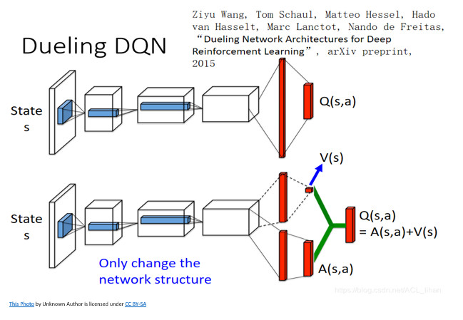

# Learning Algorithm

## Deep Q
### Learning Learning Algorithm
$e^{i \pi} = -1$
### Model Hyperparameters
### Model Architectures
## Double Deep Q
### Learning Learning Algorithm
$e^{i \pi} = -1$
### Model Hyperparameters
### Model Architectures
## Dueling Deep Q
The Dueling Deep Q changes the neural network 
### Learning Learning Algorithm

$Q_{\pi}(s, a) := V_{\pi}(s) + A_{\pi}(s, a)$ \
where \
$Q_{\pi}(s, a)$ is the expected return selecting action a using policy $\pi$ \
$V_{\pi}(s)$ The value of a state is the expected return using policy $\pi$ \
$A_{\pi}(s, a)$ The advantage is the excess expected return of action a above the value of state \
Or written another way: \
$A_{\pi}(s, a) : = Q_{\pi}(s, a) - V_{\pi}(s)$ \
		

### Model Hyperparameters
### Model Architectures
The model architecture changes from a neural network that estimates the Q values for each action (first model) to a neural network that computes the value of a state and the advantages seperatly (second model).  The seperate values are then added together to create the Q value estimates.  This should make the training process faster.

## Prioritized Experience Replay
###Deep Q
### Double Deep Q
### Dueling Deep Q

# Plot of Rewards from Experiments

# Ideas for Future Work
**Neural Net Architecture**-Possibly use a CNN layer with the feed forward neural net to help identify colors.  Experiment with different number of layers and neuron combinations.  
**Aditional Experiments**-Experiment with with a Dueling DDQN and other extensions of the DQN such as: \
1. Distributional DQN \
2. Noisy DQN \
3. Prioritized DDQN

