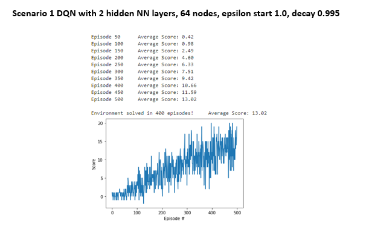
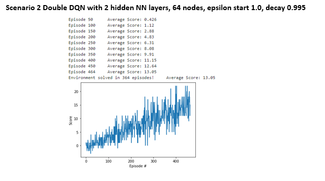
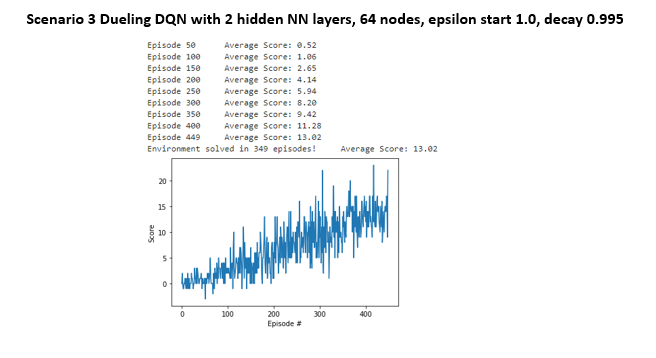
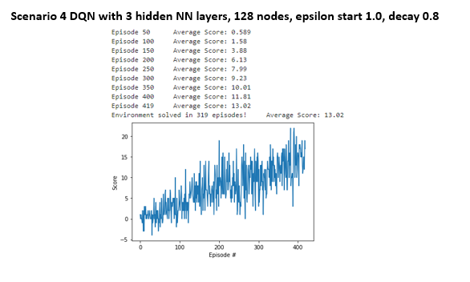
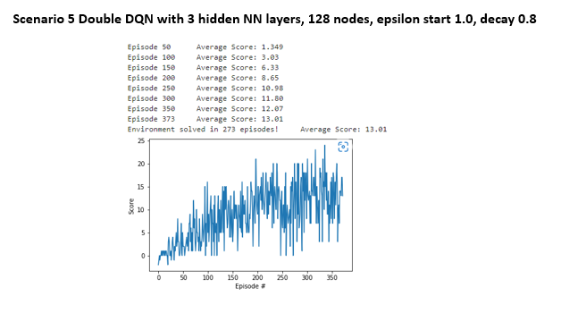
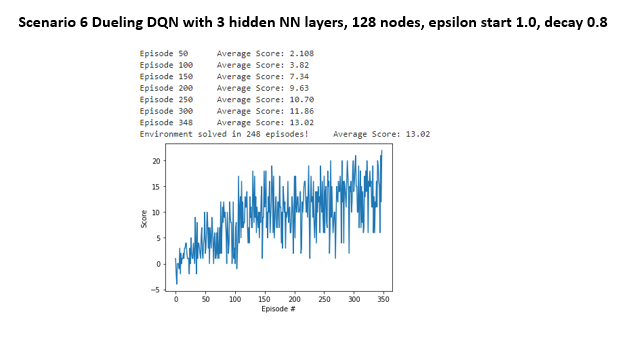
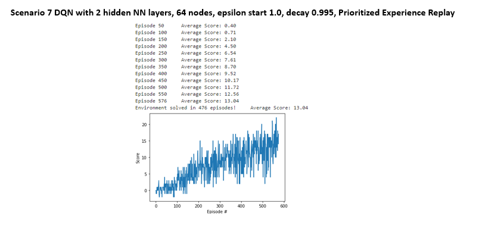
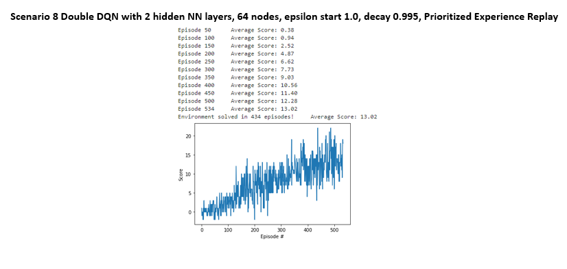
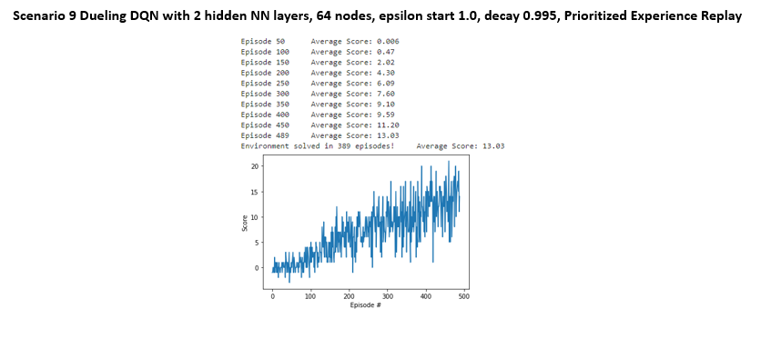

# Background
The objective of this project is to train an agent to collect bananas in a large square world.  We want the agent to collect the yellow bananas and avoid the blue bananas.  The agent has a positive reward of +1 for collecting a yellow banana and a negative reward of -1 for collecting a blue banana.  Success is measured by the agent getting an average score of +13 over 100 consecutive episodes.

## Environment Details

* State Space - state space has 37 dimensions and contains the agent's velocity, along with ray-based perception of objects around the agent's forward direction.
* Action Space - the agent has 4 discrete actions 
  * 0 = Move Forward
  * 1 = Move Backward
  * 2 = Turn Left
  * 3 = Turn Right

When the agent archives an average score of +13 over 100 consecutive episodes, the environment is solved.

### Model Hyperparameters
An infinite number of hyperparameter combinations can be used in this problem.  Including:
1. number of hidden layers in the neural network
2. number of nodes in each layer in the neural network
3. the optimizer used in the neural network
4. the learning rate of the optimizer
5. starting epsilon for the epsilon greedy policy
6. decay rate of epsilon
7. the mini batch size
8. the buffer size for the replay
9. the gamma rate for the discount factor

To limit the number of experiments, we will change only the following:
1. number of hidden layers in the neural network
2. number of nodes in each layer in the neural network
3. decay rate of epsilon.

The following Hyperparameters are kept fixed:
BUFFER_SIZE = int(1e5)   replay buffer size \
BATCH_SIZE = 64          minibatch size \
GAMMA = 0.99             discount factor \
TAU = 1e-3               for soft update of target parameters \
LR = 5e-4                learning rate \
UPDATE_EVERY = 4         how often to update the network \
n_episodes=2000		 maximum number of episodes \
max_t=1000		 maximum number of timesteps per episode \
eps_start=1.0		 Starting Epsilon for the epsilon greedy policy \
eps_end=0.01		 Starting Epsilon for the epsilon greedy policy

### A total of 9 experiments are performed
1. DQN with 2 hidden NN layers, 64 nodes, epsilon start 1.0, decay 0.995
2. Double DQN with 2 hidden NN layers, 64 nodes, epsilon start 1.0, decay 0.995
3. Dueling DQN with 2 hidden NN layers, 64 nodes, epsilon start 1.0, decay 0.995
4. DQN with 3 hidden NN layers, 128 nodes, epsilon start 1.0, decay 0.8
5. Double DQN with 3 hidden NN layers, 128 nodes, epsilon start 1.0, decay 0.8
6. Dueling DQN with 3 hidden NN layers, 128 nodes, epsilon start 1.0, decay 0.8
7. DQN with 2 hidden NN layers, 64 nodes, epsilon start 1.0, decay 0.995, Prioritized Experience Replay
8. Double DQN with 2 hidden NN layers, 64 nodes, epsilon start 1.0, decay 0.995, Prioritized Experience Replay
9. Dueling DQN with 2 hidden NN layers, 64 nodes, epsilon start 1.0, decay 0.995, Prioritized Experience Replay

The following Algorithms were tested. 

# Learning Algorithm
 
## Deep Q
### Learning Algorithm
The baseline model is the Deep Q network.  Where the states are inputs to a neural network that outputs the actions and Q-values.  Two identical networks are used, one target and one local.  The network tries to minimize the squared difference between the output Q values and the target Q values.  Then back propagation updates the weights and biases.  

### Model Architectures
The neural network architecture is a simple feed forward neural network:  
1. The inputs are the state size (for this problem it is a state space of 37)
2. The hidden layer consists of several fully connected linear layers with a relu activation function
3. The output is the number of actions we can take in the environment (for this problem the agent can take 4 actions)
4. The optimizer for this network is Adam with a learning rate of 5e-4
5. The loss function to minimize is the mean squared error of the $Q_{expected}$ and the $Q_{target}$
## Double Deep Q
### Learning Algorithm
In Double Deep Q learning we use two identical neural network models to mitigate the overestimation of the action value function problem in DQN. Two neural network models are now used to build the target.  The online network is used to get the index of the highest-valued action of the next state, then the target network gets the Q_values of the next state from the action of the online network.

One DQN is used to select the action \
$a_{t+1}^{\star} := argmax Q_{1}(s_{t+1},a_{t+1})$ \
A second DQN evaluates it \
$R + \gamma Q_{2}(s_{t+1}, a^{\star}_{t+1})$ 

### Model Architectures
The neural network does not change from the DQN, but the training process to create the target is split over two identical neural networks (one to select the action, the other to estimate the value), this helps increase stability.  
## Dueling Deep Q
### Learning Algorithm
The Dueling Deep Q does not change the training process, the changes are in the neural network output layer. The output is split into two parts: state and the advantage

$Q_{\pi}(s, a) := V_{\pi}(s) + A_{\pi}(s, a)$ \
where \
$Q_{\pi}(s, a)$ is the expected return selecting action a using policy $\pi$ \
$V_{\pi}(s)$ The value of a state is the expected return using policy $\pi$ \
$A_{\pi}(s, a)$ The advantage is the excess expected return of action a above the value of state \
Or written another way: \
$A_{\pi}(s, a) : = Q_{\pi}(s, a) - V_{\pi}(s)$ 
		
### Model Architectures
The model architecture changes from a neural network that estimates the Q values for each action (first model) to a neural network that computes the value of a state and the advantages separately (second model).  The separate values are then added together to create the Q value estimates.  This should make the training process faster.

## Prioritized Experience Replay
To make the replay buffer for efficient (currently it uses a uniform distribution), we experiment with a Prioritized Experience Replay.  Each experience will be assigned a probability from 0 to 1.  The higher the priority of an experience, the higher the probability it will get picked from the buffer.   
We assign the probability as follows
$P(i) := \frac{p_{i}^{a}}{\sum_{k}p_{k}^{a}}$ with alpha (a) regulating the priority (alpha at zero would assign a uniform distribution).
We start with alpha at 1 and slowly reduce it toward zero as training progresses.
We choose priority based on the largest temporal difference error.

# Plot of Rewards from Experiments
Results from the experiments are as follows: \

# Analysis of results
Holding the same hyperparameters constant, Double DQN and Dueling DQN did achieve the goal with fewer episodes than DQN.  Prioritized experience replay seems to increase the number of episodes to reach the goal of an average score of 13.  This may be due to the small problem size and limited states.  Prioritized experience replay may be more useful in a larger more complex problem. \
Adding complexity to the model (additional layers and nodes) made a noticeable difference in performance.  Additional layers and nodes would increase the score early in training vs. a simpler model and reach the goal with fewer episodes.  However, based on the graph it does look like a more complex model has more oscillation between episodes vs. a simpler model that has a more linear trend upward.

# Ideas for Future Work
**Neural Net Architecture**-Possibly use a CNN layer with the feed forward neural net to help identify colors.  Experiment with different number of layers and neuron combinations.  
**Aditional Expdriments**-Experiment with a Dueling DDQN and other extensions of the DQN such as: 
1. Distributional DQN 
2. Noisy DQN 
3. Prioritized DDQN

